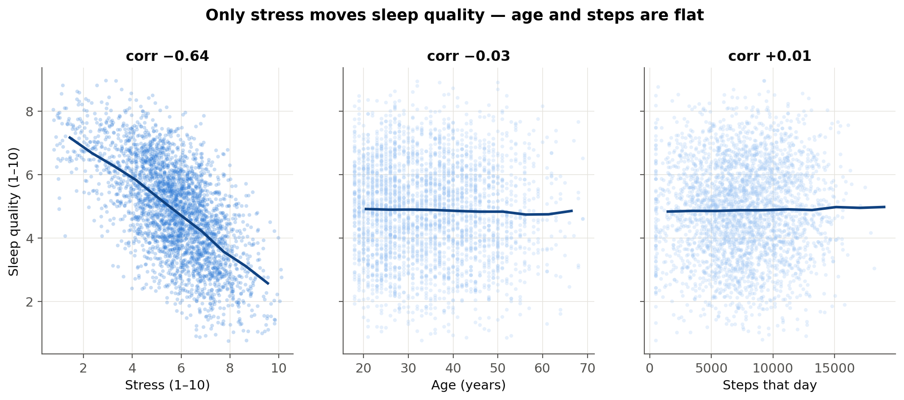
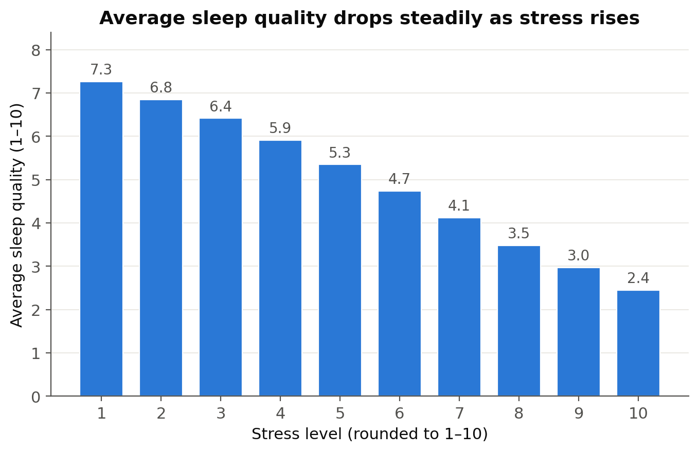

# Sleep Doctor: Predicting Sleep Quality from Lifestyle Factors

Built and compared two machine learning models that predict a person's sleep
quality (Low / Medium / High) from age, stress, and activity level, reaching 61%
accuracy against a 44.5% baseline on 100,000 health records — and discovered that
stress is the only factor that truly matters — in AI4ALL's AI4ALL Ignite
accelerator.

**🔴 Try it live: [sleep-doctor-ai4all.streamlit.app](https://sleep-doctor-ai4all.streamlit.app)**

**💻 Code & analysis: [github.com/Poudel-Sanskriti/Sleep_Doctor](https://github.com/Poudel-Sanskriti/Sleep_Doctor)**

## Problem Statement <!--- do not change this line -->

Poor sleep affects productivity, mental health, and physical health, yet most
people don't know which of their daily habits is actually hurting their sleep.
We asked: **based on age, stress level, and activity level, can we predict sleep
quality?** If a model can flag likely poor sleepers from three simple questions —
no sleep lab, no wearable — it could point people toward the lifestyle change
most worth making.

## Key Results <!--- do not change this line -->

1. **Only stress matters.** Across 100,000 records, stress correlates with sleep
   quality at r = −0.64, while age and activity sit near zero. Stress alone
   predicts sleep quality about as well as all three factors combined.
2. **Both models beat the baseline, then tie.** Always guessing the most common
   class scores 44.5%. Our Linear Regression reached **61.2%** and our tuned
   Random Forest **61.3%** on a held-out test set of 15,000 people — a 17-point
   lift. The tie is itself a finding: there is no hidden non-linear pattern, just
   one clean linear stress effect (a Gradient Boosting challenger also tied,
   confirming the ceiling belongs to the features, not the algorithm).
3. **We found and fixed real overfitting.** The default Random Forest memorized
   noise and scored 54.5%; capping tree depth (validated on a separate
   validation set) raised it to 61.8%.
4. **An extension analysis raised accuracy to 68%** by adding lifestyle context
   (work hours, shift work, caffeine, screen time, mental health) — and produced
   new findings: shift work costs about a full point of sleep quality.
5. **We deployed the model** as a public web app that explains every prediction
   it makes.

### Our strongest evidence

*Sleep quality falls steadily as stress rises (left), while age and daily steps
show no pattern at all — one chart, whole project.*

## Methodologies <!--- do not change this line -->

This is a **supervised learning** project. The dataset scores each person's
sleep quality on a continuous 1–10 scale; we defined the three classes with a
fixed rule — round the score to the nearest whole number, then cut at
**≤4 = Low, 5–6 = Medium, ≥7 = High** (41.5% / 44.5% / 14% of people). We split
100,000 records into 70% train / 15% validation / 15% test (stratified, fixed
seed), then trained two models as proposed: **Path A — Linear Regression** takes
age, stress, and activity as inputs and predicts the continuous 1–10 score,
which that same rule then buckets into a class; **Path B — Random Forest**
predicts the class directly. We compared both on the validation set, tuned the forest's
depth there, and touched the test set exactly once per final model. We
interpreted models with permutation feature importance (the default importances
were misleading — they falsely ranked step count first), verified stability with
5-fold cross-validation, and audited fairness across occupation and gender.
After answering the research question, we ran a follow-up extension: we added 13
lifestyle and context columns (converting text categories to numbers via one-hot
encoding), deliberately excluded features that are consequences of sleep rather
than causes (like feeling rested — using them would be circular), and re-ran the
same train/validate/test discipline, reaching 68% test accuracy (R² 0.60). All
work was collaborative through 11 reviewed pull requests on GitHub, and results
were independently reproduced with fresh splits and different random seeds
before merging.

## Impact & Bias

**Positive impact:** the finding is actionable and free — if you want better
sleep, target stress, not step counts. A wellness program could flag likely poor
sleepers with three questions and point them to stress management first.

**How AI/ML could amplify bias here:** our dataset covers only 12 occupations,
missing gig, retail, and agricultural workers — the model is least reliable for
exactly the irregular-schedule jobs where sleep problems may be worst. Stress
and sleep quality are self-rated, so the model learns rating habits, not ground
truth. Our fairness audit found accuracy varies across occupations, and the rare
"High" class (14% of people) has the weakest recall — the model under-serves
good sleepers. Presenting patterns from a synthetic dataset as facts about human
sleep would compound all of this.

**How we mitigated it:** stratified splits keep every class fairly represented;
we report lift over a baseline instead of a bare accuracy number; we excluded
leakage features (consequences of sleep, like feeling rested) that would have
inflated performance; we ran the occupation/gender fairness audit and publish
its limits; and the app carries an honesty note — synthetic data, ~60% of
variation unexplained, not medical advice.

## Data Sources <!--- do not change this line -->

Kaggle: [Sleep Health & Daily Performance Dataset](https://www.kaggle.com/datasets/mohankrishnathalla/sleep-health-and-daily-performance-dataset)
(100,000 records, 32 variables, synthetic).

## Technologies Used <!--- do not change this line -->

- Python (pandas, NumPy)
- scikit-learn (LinearRegression, RandomForestClassifier, HistGradientBoostingClassifier)
- Matplotlib · Altair
- Streamlit + Streamlit Community Cloud (deployment)
- Git & GitHub (feature-branch + pull-request workflow)
- Jupyter Notebooks

## Next Steps

- Validate the findings on real, non-synthetic sleep data (CDC NHANES / BRFSS
  carry sleep items) — the most valuable possible follow-up.
- Add measured-sleep features (duration, wake episodes) as a separate
  wearable-data model (~R² 0.77 in our experiments).
- Try ordinal models, since Low / Medium / High is an ordered outcome.
- Close the occupation fairness gap before any real-world use.

## Citations

1. Kim, W., Um, Y. H., et al. (2021). Association between age and sleep quality:
   Findings from a community health survey. *Sleep Medicine Research*, 12(2).
   https://www.sleepmedres.org/journal/view.php?number=193
2. Nguyen, A. W., Bubu, O. M., Ding, K., & Lincoln, K. D. (2024). Chronic stress
   exposure, social support, and sleep quality among African Americans.
   *Ethnicity & Health*. https://pmc.ncbi.nlm.nih.gov/articles/PMC11272438/
3. Zhao, H., Lu, C., & Yi, C. (2023). Physical activity and sleep quality
   association in different populations: A meta-analysis. *IJERPH*, 20(3).
   https://pmc.ncbi.nlm.nih.gov/articles/PMC9914680/
4. Alnawwar, M. A., et al. (2023). The effect of physical activity on sleep
   quality and sleep disorder: A systematic review. *Cureus*.
   https://pmc.ncbi.nlm.nih.gov/articles/PMC10503965/

## Authors <!--- do not change this line -->

Quang Doan · Shaili Halani · Nathanael Owusu · Prevailer Nchekwube ·
Sanskriti Poudel · Alex Saidov
