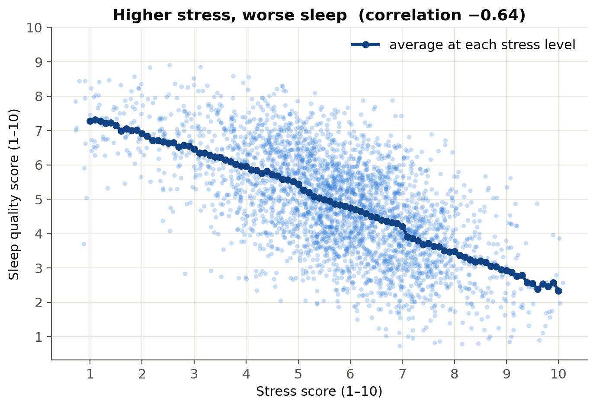
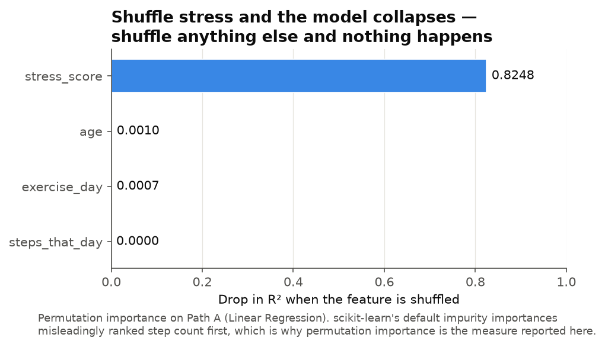
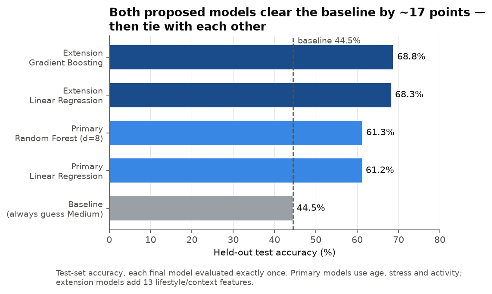
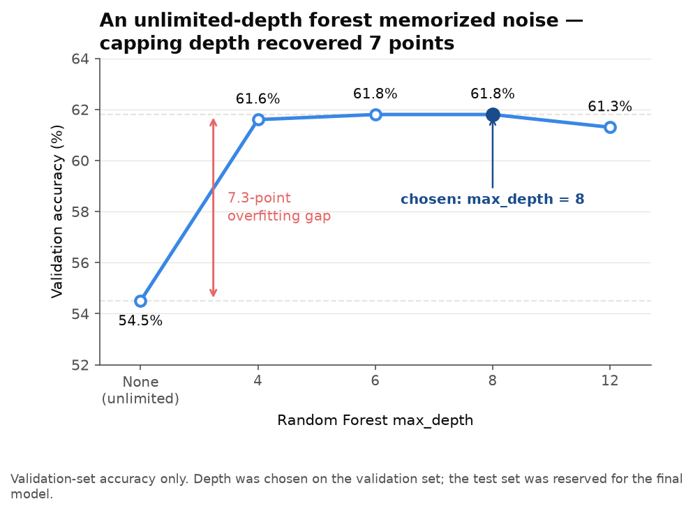
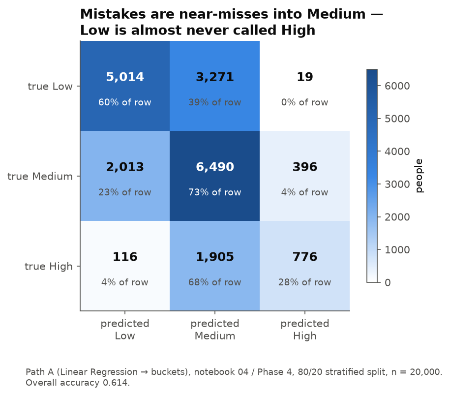
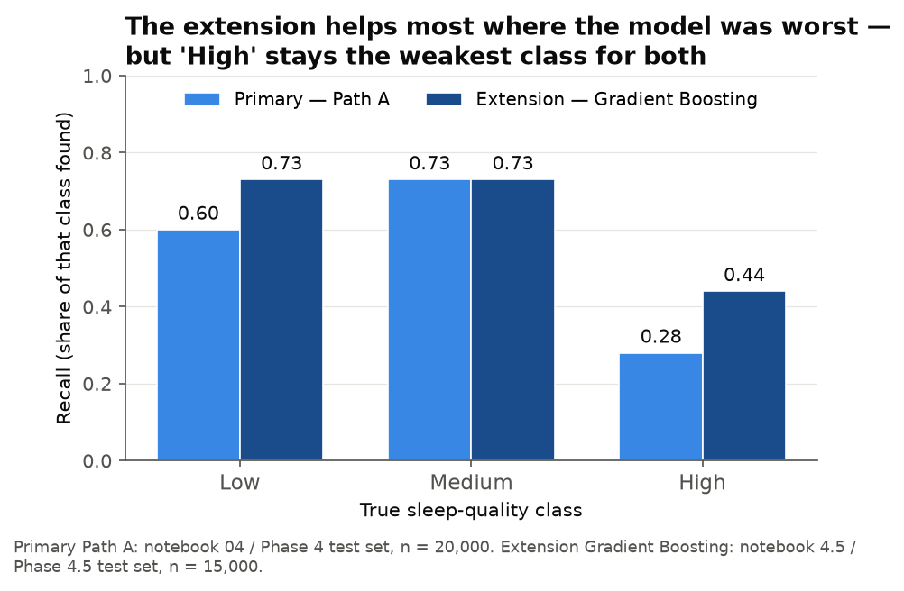
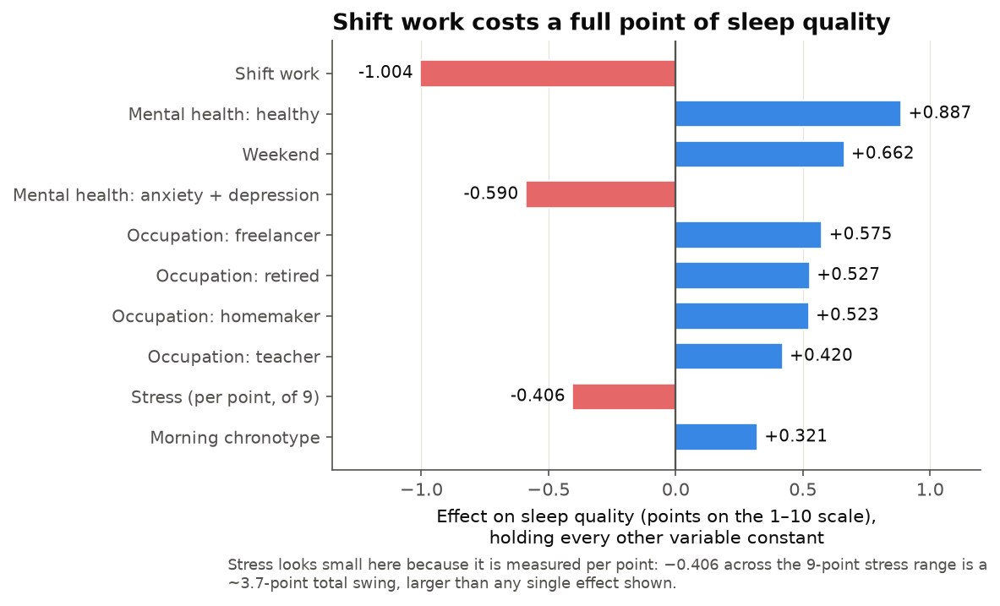
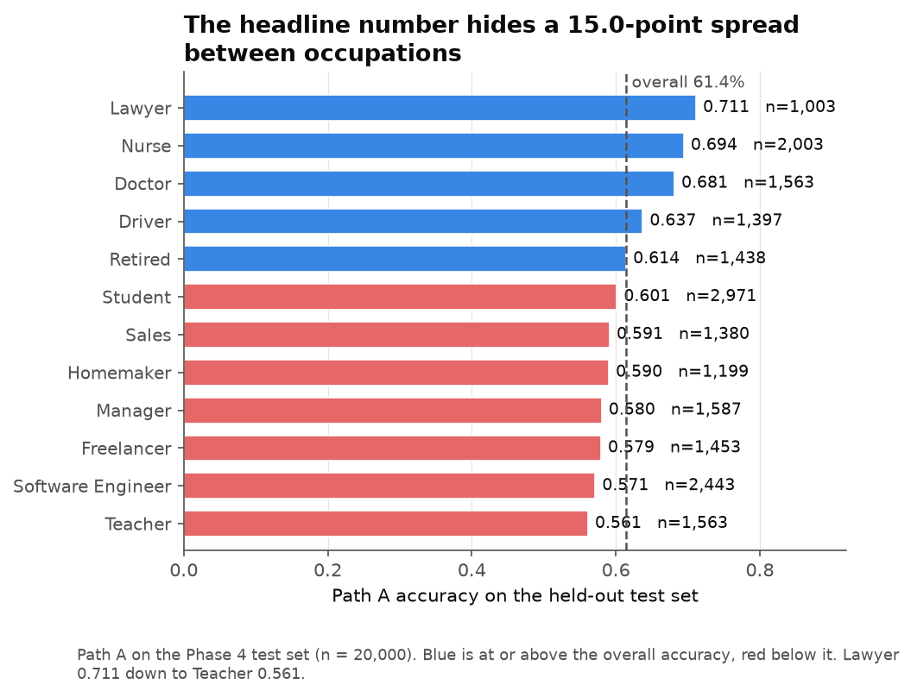
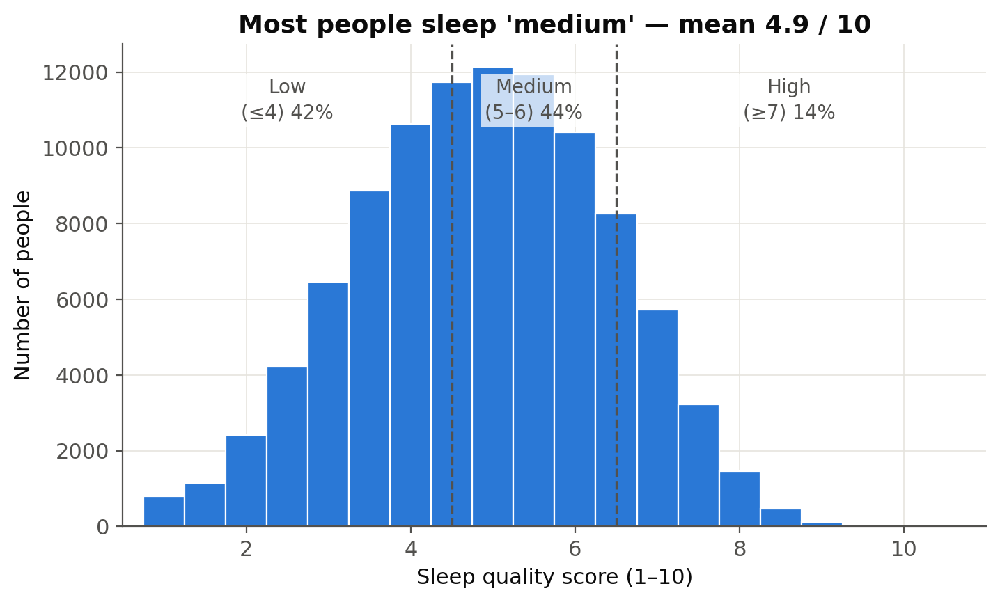
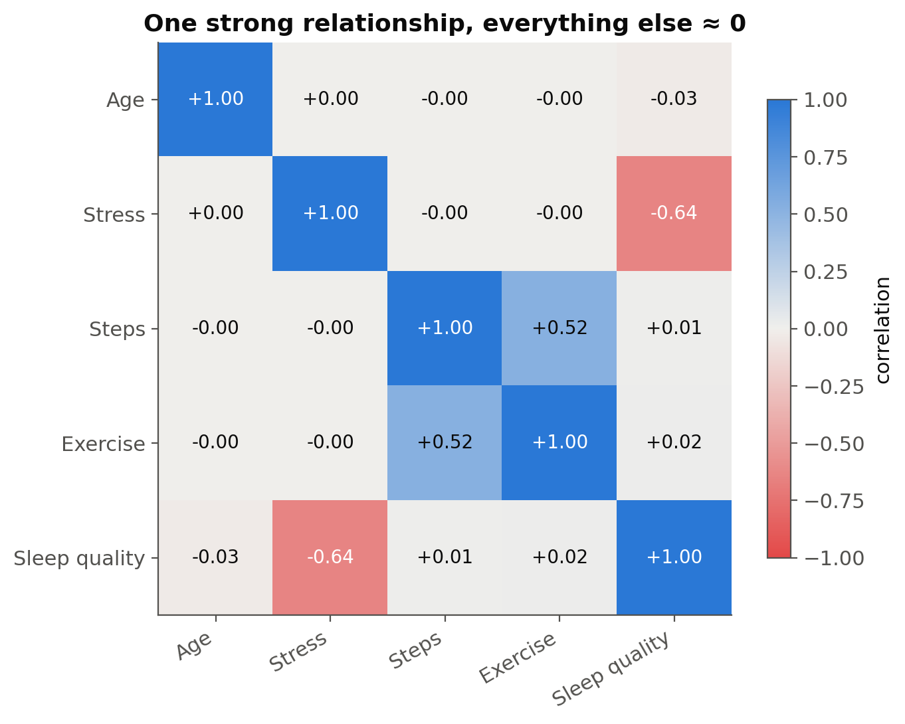

We built and compared two machine learning models that predict a person's sleep
quality (Low / Medium / High) from age, stress, and activity level across
100,000 health records — reaching **61.3%** accuracy against a **44.5%**
baseline, and finding that **stress is the only one of the three that matters
at all**.

  <a href="https://sleep-doctor-ai4all.streamlit.app" style="display:inline-block; padding:0.7rem 1.2rem; background-color:#3987e5; color:#ffffff; border-radius:0.4rem; font-weight:700; text-decoration:none;">Try the live app &rarr;</a>
  <a href="https://github.com/Poudel-Sanskriti/Sleep_Doctor" style="display:inline-block; padding:0.7rem 1.2rem; background-color:#1a4c8b; color:#ffffff; border-radius:0.4rem; font-weight:700; text-decoration:none;">Code &amp; notebooks</a>
  <a href="https://www.kaggle.com/datasets/mohankrishnathalla/sleep-health-and-daily-performance-dataset" style="display:inline-block; padding:0.7rem 1.2rem; background-color:#ffffff; color:#1a4c8b; border:1px solid #1a4c8b; border-radius:0.4rem; font-weight:700; text-decoration:none;">Dataset</a>

  

    
100,000

    
records analyzed

  

  

    
&minus;0.64

    
stress &harr; sleep correlation

  

  

    
61.3%

    
test accuracy vs 44.5% baseline

  

  

    
68.8%

    
with full lifestyle context

  

  

    
11

    
reviewed pull requests

  

## Problem Statement <!--- do not change this line -->

Poor sleep affects productivity, mental health, and physical health, yet most
people don't know which of their daily habits is actually hurting their sleep.

> **Research question:** Based on age, stress level, and activity level, can we
> predict sleep quality?

If a model can flag likely poor sleepers from three simple questions — no sleep
lab, no wearable — it could point people toward the lifestyle change most worth
making.

## Key Results <!--- do not change this line -->

### 1. Only stress matters

Across 100,000 records, stress correlates with sleep quality at **r = −0.639**,
while age (−0.025), steps (+0.014), and exercise (+0.022) sit at essentially
zero. Stress alone predicts sleep quality about as well as all three factors
combined.

*The whole project in one scatter: higher stress, worse sleep, correlation
−0.64.*

*Sleep quality falls steadily as stress rises (left), while age and daily steps
show no pattern at all — one chart, whole project.*

*Average sleep quality falls at every single step of the stress scale, from 7.3
down to 2.4 — a monotonic slide with no plateau.*

Shuffling a feature and measuring how much the model degrades (permutation
importance) makes the same point far more sharply than any correlation table:

*Destroy the stress column and the model loses 0.825 of its R². Destroy any
other column and it loses effectively nothing.*

A **t-test** confirms the size of the effect: high-stress people (n = 22,289)
average **3.56** on the sleep-quality scale against **6.84** for low-stress
people (n = 6,130) — a **3.28-point gap**, t = −194.5, p ≈ 0.

The exercise comparison is the methodological lesson of the project. It is
*also* "statistically significant" (t = 6.8, p = 1.04e-11) — on a gap of
**0.07 points** (4.91 vs 4.84). At n = 100,000, almost anything clears a
p-value threshold, which is exactly why we judged every finding on effect size
instead.

### 2. Both models beat the baseline, then tie

Always guessing the most common class scores 44.5%. Both of our proposed models
clear that by about 17 points on the held-out test set — and then finish a tenth
of a point apart.

*The tie is itself the finding: a tree ensemble free to hunt for curves and
interactions cannot beat a straight line, so the signal really is one clean
linear stress effect.*

### 3. We found and fixed real overfitting

A Random Forest with unlimited depth memorized noise and scored 54.5% on the
validation set. Capping tree depth recovered 7.3 points.

*Validation-set accuracy only. Depth was chosen here and the test set stayed
sealed until the final model was fixed.*

### 4. Where the models are wrong

Errors are overwhelmingly near-misses into the middle class. Low is almost never
mistaken for High, and vice versa.

*Path A on the Phase 4 test set (n = 20,000). The model's mistakes are
one-bucket mistakes.*

The rare "High" class is the weak point, and stays the weak point. Recall on
High is just **0.28** for the primary model — of every 100 genuinely good
sleepers, the model finds 28.

*The extension helps most where the primary model was worst — but High remains
the weakest class for both.*

### 5. Lifestyle context lifts accuracy to 68%

Adding 13 lifestyle and context features (work hours, shift work, caffeine,
screen time, chronotype, mental health, occupation) raises R² from **0.411** to
**0.601** and test accuracy to **68.8%** — and produces new, interpretable
findings of its own.

*Shift work costs about a full point of sleep quality, holding everything else
constant. Stress's bar looks small only because it is measured **per point** —
across the 9-point stress range that is a ~3.7-point swing, larger than any
single effect on the chart.*

### 6. Accuracy is not evenly distributed

The headline number hides who the model serves badly. Path A's accuracy ranges
from 0.711 for lawyers down to 0.561 for teachers — a **15.0-point spread**.

*A single headline accuracy is an average over groups it does not serve equally.
Seven of twelve occupations sit below the overall line.*

## Results at a Glance

All figures below are **test-set** results, with each final model visiting the
test set exactly once.

| Model | Features | Test accuracy | Lift over baseline | R² |
|---|---|---|---|---|
| Baseline (always guess Medium) | — | 44.5% | — | — |
| Path A — Linear Regression | age, stress, activity | 61.2% | +16.7 pts | 0.411 |
| Path B — Random Forest (`max_depth=8`) | age, stress, activity | 61.3% | +16.8 pts | — |
| Extension — Linear Regression | + 13 lifestyle/context | 68.3% | +23.8 pts | 0.601 |
| Extension — Gradient Boosting | + 13 lifestyle/context | 68.8% | +24.3 pts | — |

**On the Gradient Boosting entry.** It was never a proposed model — it entered
as a *challenger*, to test whether **any** algorithm could beat the two we
proposed. On the primary features it reached 61.8%\*, landing with Linear
Regression (62.0%\*) and the tuned Random Forest (61.8%\*) inside a fifth of a
point of each other. Three different algorithm families arriving at the same
ceiling is what proves the limit belongs to the **features**, not the algorithm.

**Stability.** 5-fold cross-validation puts Path A at R² **0.409 ± 0.002** and
Path B (untuned) at accuracy **0.549 ± 0.005** — the results are not an artifact
of one lucky split.

\* Validation-set figure. Each *final* model touches the test set exactly once,
so comparisons made while choosing between models are reported as validation
scores rather than a second, invalid trip to the test set.

## The Data

100,000 rows × 32 columns, **synthetic**, from Kaggle. Integrity checks came
back clean: **0 missing values, 0 duplicate rows, 0 duplicate person IDs**, and
every range humanly plausible — age 18–69, stress 1–10, steps 500–20,000, sleep
duration 3.0–10.5 hours.

The target, sleep quality, has mean **4.87**, median **4.9**, and SD **1.51**.
Rounding each score to the nearest integer and cutting at ≤4 / 5–6 / ≥7 gives
the three classes at **41.5% / 44.5% / 14.0%** — that 44.5% Medium share is the
baseline every model has to beat.

*The target distribution and the exact cut points that define the three classes.*

*One strong relationship, everything else ≈ 0. Steps and exercise correlate with
each other (+0.52) but neither relates to sleep quality — and stress is
uncorrelated with the other predictors, so its coefficient is clean of
multicollinearity.*

**An ethics decision on outliers.** We kept statistical outliers rather than
auto-deleting them. Blind outlier removal is not a neutral cleaning step: the
rows it discards are disproportionately real groups — shift workers, people with
extreme schedules — and dropping them would have quietly improved our metrics by
deleting the people the model serves worst.

### What we refused to use

Several columns would have raised our accuracy and made the project worthless.
We excluded them on principle and documented why.

| Excluded column | r with sleep quality | Why it was excluded |
|---|---|---|
| `cognitive_performance_score` | 0.860 | **Leakage** — a *consequence* of sleeping well, not a cause |
| `felt_rested` | 0.479 | **Leakage** — this is nearly the target restated |
| `sleep_disorder_risk` | — | **Leakage** — downstream of sleep quality |
| `sleep_duration_hrs` | 0.646 | **Measured sleep** — not knowable before going to bed |
| `wake_episodes_per_night` | −0.381 | **Measured sleep** |
| `sleep_latency_mins` | −0.293 | **Measured sleep** |
| `rem_percentage` | 0.254 | **Measured sleep** |
| `deep_sleep_percentage` | 0.091 | **Measured sleep** |
| `sleep_aid_used` | 0.049 | **Measured sleep** |
| `heart_rate_resting_bpm` | −0.066 | **No signal** (\|r\| < 0.07) |
| `room_temperature_celsius` | −0.023 | **No signal** |
| `weekend_sleep_diff_hrs` | −0.006 | **No signal** |
| `person_id` | 0.002 | **No signal** — an identifier, not a feature |

The rule we held to: a *lifestyle* model may only use what a person knows
**before** going to bed. Using `felt_rested` to predict sleep quality is
circular, and a model built on it would score beautifully while telling nobody
anything they could act on.

## The Live App

*A high-stress shift worker lands at 1.9 / 10 — class **Low** — with every input's
contribution shown. The app explains each prediction rather than just emitting it.*

**[Open the app &rarr;](https://sleep-doctor-ai4all.streamlit.app)**

The app follows a **train/serve split**, the way production ML systems separate
fitting a model from using it:

| File | Role |
|---|---|
| `train.py` | Fits the models offline, evaluates them, and exports coefficients and metrics to `models.json`. |
| `models.json` | The trained artifact the app ships — small and human-readable, with no pickle or version-lock headaches. |
| `model_config.py` | The feature schema shared by `train.py` and `app.py`, so serving can never drift from training. |
| `app.py` | Loads `models.json` at startup and predicts. It never retrains. |

`train.py` uses the same 70/15/15 stratified split and seed 117 as the
notebooks, so the app's reported numbers match the analysis exactly.

## Methodologies <!--- do not change this line -->

  

    
NOTEBOOK 01

    
Data verification

  

  

    
NOTEBOOK 02

    
Statistics

  

  

    
NOTEBOOK 03

    
Visualization

  

  

    
NOTEBOOK 04

    
Two models

  

  

    
NOTEBOOK 05

    
Tuning &amp; extension

  

  

    
APP.PY

    
Deployment

  

| Notebook | Phase | What it does |
|---|---|---|
| `01_setup_and_cleaning.ipynb` | 1 | Load the dataset, verify integrity, sanity-check every value range |
| `02_statistics.ipynb` | 2 | Descriptive statistics, correlations, t-tests |
| `03_visualization.ipynb` | 3 | The five exploratory charts (saved to `figures/`) |
| `04_models.ipynb` | 4 | Train, compare, and evaluate both proposed models |
| `05_model_refinements.ipynb` | 4.5 | 70/15/15 split, forest depth tuning, the Gradient Boosting challenger, and the lifestyle extension |

This is a **supervised learning** project. The dataset scores each person's
sleep quality on a continuous 1–10 scale; we defined the three classes with a
fixed rule — round to the nearest whole number, then cut at **≤4 = Low,
5–6 = Medium, ≥7 = High**.

**The split discipline.** 100,000 records into **70% train / 15% validation /
15% test**, stratified, with a fixed seed of **117** — 70,000 / 15,000 / 15,000.
Every tuning decision (forest depth, model choice, the challenger comparison)
was made on the **validation set only**. Each final model touched the **test set
exactly once**. Nothing on this page reports a number from a second visit.

We then trained the two models as proposed: **Path A — Linear Regression** takes
age, stress, and activity, predicts the continuous 1–10 score, and buckets it
with that same rule; **Path B — Random Forest** predicts the class directly. We
interpreted both with **permutation feature importance** — the default impurity
importances were actively misleading, falsely ranking step count first —
verified stability with **5-fold cross-validation**, and audited fairness across
occupation and gender.

After answering the research question, we ran a follow-up **extension**: 13
lifestyle and context columns added (text categories one-hot encoded to 33
columns), features that are *consequences* of sleep deliberately excluded, and
the same train/validate/test discipline re-run — reaching 68% test accuracy at
R² 0.601.

All work was collaborative through **11 reviewed pull requests**, with `main`
protected, one branch per phase, and `feat:` / `fix:` / `docs:` / `chore:`
commit prefixes. Results were independently reproduced with fresh splits and
different random seeds before merging.

## Impact & Bias

**Positive impact:** the finding is actionable and free — if you want better
sleep, target stress, not step counts. A wellness program could flag likely poor
sleepers with three questions and point them toward stress management first.

**How AI/ML could amplify bias here.** Our fairness audit found concrete,
measurable gaps:

- **Occupation: a 15.0-point spread.** Path A scores 0.711 for lawyers and
  0.561 for teachers. Software engineers (0.571, n = 2,443) and students
  (0.601, n = 2,971) — two of the largest groups in the data — both sit below
  the 61.4% overall accuracy.
- **Gender: under 1 point of spread.** Female 0.614, Male 0.614, Other 0.605
  (n = 400). Even here, the "Other" group is small enough that its estimate is
  the least reliable of the three.
- **The rare class is served worst.** High-class recall is **0.28** for the
  primary model — good sleepers, only 14.0% of the data, are the people the
  model identifies least well.

Beyond the audit: the dataset covers only 12 occupations, missing gig, retail,
and agricultural workers — so the model is least reliable for exactly the
irregular-schedule jobs where sleep problems may be worst. Stress and sleep
quality are both self-rated, so the model learns rating habits, not ground
truth. And presenting patterns from a synthetic dataset as facts about human
sleep would compound all of it.

**How we mitigated it:** stratified splits keep every class fairly represented;
we report lift over a baseline instead of a bare accuracy number; we excluded
leakage features that would have inflated performance; we ran the
occupation/gender fairness audit and publish its limits rather than its
headline; and the app carries an honesty note — synthetic data, ~40% of the
variation still unexplained even by the extension model (~59% by the
research-question model), not medical advice.

## Data Sources <!--- do not change this line -->

Kaggle: [Sleep Health & Daily Performance Dataset](https://www.kaggle.com/datasets/mohankrishnathalla/sleep-health-and-daily-performance-dataset)
— 100,000 records, 32 variables, **synthetic**.

## Technologies Used <!--- do not change this line -->

- **Data** — Python, pandas, NumPy
- **Modeling** — scikit-learn: `LinearRegression`, `RandomForestClassifier`,
  `HistGradientBoostingClassifier`, `permutation_importance`
- **Visualization** — Matplotlib (analysis charts), Altair (in-app charts)
- **Deployment** — Streamlit + Streamlit Community Cloud
- **Collaboration** — Git & GitHub (protected `main`, feature branches,
  pull-request review), Jupyter Notebooks

## Next Steps

- Validate the findings on real, non-synthetic sleep data (CDC NHANES / BRFSS
  carry sleep items) — the most valuable possible follow-up.
- Add measured-sleep features (duration, sleep latency, wake episodes) as a
  separate model — a different use case: *estimating* sleep quality from tracker
  data rather than *predicting* it from lifestyle choices.
- Try ordinal models, since Low / Medium / High is an ordered outcome that both
  of our paths currently treat as unordered.
- Close the occupation fairness gap before any real-world use.

## Citations

1. Kim, W., Um, Y. H., et al. (2021). Association between age and sleep quality:
   Findings from a community health survey. *Sleep Medicine Research*, 12(2).
   <https://www.sleepmedres.org/journal/view.php?number=193>
2. Nguyen, A. W., Bubu, O. M., Ding, K., & Lincoln, K. D. (2024). Chronic stress
   exposure, social support, and sleep quality among African Americans.
   *Ethnicity & Health*. <https://pmc.ncbi.nlm.nih.gov/articles/PMC11272438/>
3. Zhao, H., Lu, C., & Yi, C. (2023). Physical activity and sleep quality
   association in different populations: A meta-analysis. *IJERPH*, 20(3).
   <https://pmc.ncbi.nlm.nih.gov/articles/PMC9914680/>
4. Alnawwar, M. A., et al. (2023). The effect of physical activity on sleep
   quality and sleep disorder: A systematic review. *Cureus*.
   <https://pmc.ncbi.nlm.nih.gov/articles/PMC10503965/>

## Authors <!--- do not change this line -->

  Quang Doan,
  Shaili Halani,
  Nathanael Owusu,
  Prevailer Nchekwube,
  Sanskriti Poudel,
  Alex Saidov

---

  <strong style="color:#1a4c8b;">An AI4ALL Ignite portfolio project.</strong>
  Built on a synthetic dataset — the patterns here are evidence about our methods, not verified facts about human sleep.
   
  <a href="https://github.com/Poudel-Sanskriti/Sleep_Doctor" style="color:#1a4c8b; font-weight:600;">Code &amp; notebooks</a>
   &middot; 
  <a href="https://sleep-doctor-ai4all.streamlit.app" style="color:#1a4c8b; font-weight:600;">Live app</a>

